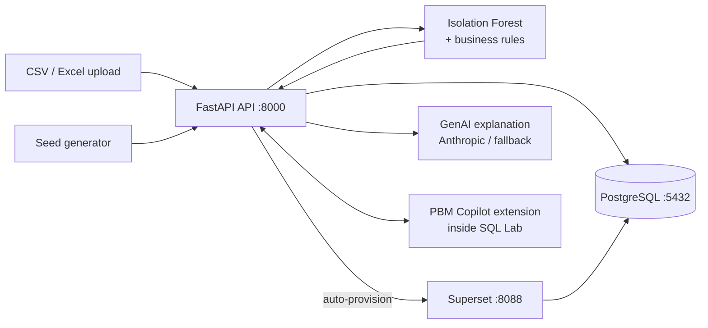

# PBM Claims Anomaly & Compliance Copilot

Synthetic **Pharmacy Benefit Manager (PBM) claims** → rule-based + ML anomaly detection → risk-ranked triage → **Superset dashboards** with **GenAI evidence explanations** for human reviewers.

> **Important:** all claim data is synthetic. This is a technical demonstration, not production clinical/compliance software.


---

## Architecture



- **Detection** – deterministic PBM business rules (duplicate claims, refill-too-soon, NDC mismatches) combined with a per-company **Isolation Forest** baseline.
- **Triage** – every claim gets a risk score and risk level; high-risk claims form a prioritized review queue.
- **Review** – a Superset dashboard (`PBM Claims Risk & Compliance Command Center`) is provisioned automatically and pre-filtered per company.
- **Explain** – GenAI summarizes the evidence behind each anomaly for a human reviewer (deterministic fallback when no API key is set).

---

## Quick start

1. **Configure**

   ```bash
   cp .env.example .env      # optional: add CLAUDE_API_KEY, PBM_API_TOKEN
   ```

2. **Launch the stack**

   ```bash
   docker compose up -d --build
   ```

3. **Verify**

   | Service          | URL                       |
   | ---------------- | ------------------------- |
   | Upload UI + API  | http://localhost:8000     |
   | API docs         | http://localhost:8000/docs |
   | Superset         | http://localhost:8088     |
   | Superset login   | `admin` / `admin` (demo)  |

4. **Load demo data**

   ```bash
   docker compose exec api python -m app.seed          # 100K synthetic claims
   ```

   Or generate a company-style sample file (pure stdlib, no installs):

   ```bash
   python script/make_sample_csv.py --rows 5000         # -> sample_claims.csv
   python script/make_sample_csv.py --rows 5000 --seed 7
   ```

   The output has the exact 17 required columns with ~4.5% injected anomalies.

5. **Upload a company's data**

   Open http://localhost:8000, enter a company name, pick a CSV/Excel file, and click **Upload & Process**. The upload response and history table link straight to the company's filtered Superset dashboard.

---

## How it works

### Upload pipeline

`POST /api/upload` validates the file, trains a per-company Isolation Forest baseline, applies the business rules, scores every claim, replaces that company's previous rows, and records it in the `companies` table.

Required columns (exact, in any order):

```
claim_id, claim_date, member_id, provider_id, plan_id, product_id,
quantity, days_supply, unit_price, allowed_unit_price, paid_amount,
allowed_amount, provider_claim_count_30d, is_duplicate,
refill_too_soon, ndc_mismatch, status
```

Re-uploading the same company replaces its existing data. Per-file errors are reported for missing columns, bad types, duplicate `claim_id`s, and size/row limits. Seed data is tagged `company_id = SEED_DEMO`.

### Automatic Superset provisioning

After every upload the API self-provisions Superset (idempotent, via the Superset REST API):

- the `PBM Claims` database connection and the `claims` dataset,
- 7 charts: Total Claims, Anomalies, Risk Level Distribution, Anomalies by Provider, Claims Trend by Risk Level, Top Risk Claims, and Claim AI Explain,
- the dashboard **PBM Claims Risk & Compliance Command Center** with a `company_id` native filter.

Each company's **"Open your dashboard"** link carries a rison-encoded filter state, e.g. `?native_filters=(NATIVE_FILTER-...:(filterState:...,extraFormData:...))`, so the dashboard opens pre-filtered to that company's data. `POST /api/provision` re-provisions manually; provisioning also self-heals at API startup.

If Superset runs on a different host/port, set `SUPERSET_URL` and `SUPERSET_PUBLIC_URL` in `.env`.

### PBM Copilot Superset extension

The repo ships a packaged Superset extension (`.supx`) that adds a **PBM Copilot** panel to SQL Lab with an Upload / Companies / Anomalies / Explain / Settings UI talking directly to the API. It is baked into the Superset image at build time:

```bash
docker compose up -d --build
```

Then open Superset → SQL Lab → the **PBM Copilot** panel. In its **Settings** tab, set the API base URL (default `http://localhost:8000`) and, if you set `PBM_API_TOKEN` in `.env`, the token. Click **Test connection**.

> The `superset` service has no volume mount for `./extensions` — the bundle is copied into the image at build time. To deploy a rebuilt bundle you must **rebuild the image**, not just restart the container.

Rebuilding the extension from source (needs Node.js 20+):

```bash
cd extensions/pbm-copilot/frontend
npm install
node bundle.mjs            # -> ../../pbm.pbm-copilot-<version>.<ts>.supx
Copy-Item ../pbm.pbm-copilot-*.supx ../../superset/extensions/   # PowerShell
# macOS/Linux: cp ../pbm.pbm-copilot-*.supx ../../superset/extensions/
docker compose build superset
docker compose up -d superset
```

The bundle contains only frontend code; it registers a view at the `sqllab.panels` contribution point (the only view area Superset 6.1 exposes) and calls the API from the browser — so `SUPERSET_ORIGIN` must include the Superset origin for CORS (default `http://localhost:8088`).

The dashboard's **Claim AI Explain** iframe chart embeds the API's explain page; its URL comes from `PBM_API_PUBLIC_URL` (default `http://localhost:8000`). It must be reachable from the user's browser and should match the API base URL in the extension's Settings tab. Changing it re-provisions the dashboard automatically.

---

## API reference

| Method | Endpoint               | Auth¹ | Description                                  |
| ------ | ---------------------- | ----- | -------------------------------------------- |
| GET    | `/health`              | –     | Liveness check                               |
| GET    | `/api/config`          | –     | Service metadata, auth mode                  |
| GET    | `/metrics`             | –     | Aggregate claims / anomaly stats             |
| GET    | `/anomalies`           | –     | Anomaly list with risk scores and rule codes |
| GET    | `/claims/{claim_id}`   | –     | Single claim detail + evidence               |
| GET    | `/explain/view/{claim_id}` | – | HTML explain page (dashboard iframe)         |
| POST   | `/explain/{claim_id}`  | token | GenAI evidence explanation                   |
| POST   | `/api/upload`          | token | Validate, score, and store company data      |
| POST   | `/api/provision`       | token | Re-provision the Superset dashboard          |
| POST   | `/seed`                | token | Seed 100K synthetic demo claims              |
| GET    | `/api/companies`       | –     | Upload history with per-company dashboard links |

¹ When `PBM_API_TOKEN` is set, endpoints marked **token** require an `X-API-Token` header. Read endpoints stay open for the demo; the extension stores the token in your browser only.

---

## Configuration

| Variable              | Default                    | Purpose                                        |
| --------------------- | -------------------------- | ---------------------------------------------- |
| `CLAUDE_API_KEY`      | *(empty)*                  | Enables real LLM explanations                 |
| `CLAUDE_MODEL`        | `claude-haiku-4-5`         | Anthropic model for explanations              |
| `PBM_API_TOKEN`       | *(empty)*                  | Requires `X-API-Token` on write/explain routes |
| `SUPERSET_ORIGIN`     | `http://localhost:8088`    | CORS origin for the browser extension         |
| `PBM_API_PUBLIC_URL`  | `http://localhost:8000`    | Browser-reachable API URL (explain iframe)    |
| `SUPERSET_SECRET_KEY` | `pbm-demo-change-me`       | Change for anything beyond a local demo       |

---

## Project structure

```
├── backend/
│   ├── app/
│   │   ├── main.py               # FastAPI routes
│   │   ├── superset_client.py    # Idempotent Superset auto-provisioning
│   │   ├── anomaly.py            # Rules + Isolation Forest scoring
│   │   ├── explain.py            # GenAI explanation (with fallback)
│   │   └── seed.py               # 100K synthetic claims generator
│   └── tests/                    # pytest suite
├── extensions/pbm-copilot/       # Superset extension source (.supx)
├── script/make_sample_csv.py     # Company-style CSV generator
├── sql/init.sql                  # PostgreSQL schema bootstrap
├── superset/Dockerfile           # Superset image with extension baked in
└── docker-compose.yml
```

---

## Testing

```bash
docker compose exec api python -m pytest tests -q
```

---

## Demo script / presentation story

Don't say "AI detects fraud". Say:

> "The system combines deterministic PBM business rules with an unsupervised baseline anomaly model. The result is a risk-ranked triage queue. GenAI sits after detection and explains the evidence for a human reviewer."

Business value:

- reduces manual first-pass review
- prioritizes high-risk claims
- makes anomaly evidence easier to understand
- gives analysts a repeatable investigation path
- preserves an audit trail through stored scores, rule codes, and evidence

---

## Production evolution

For production, add:

- real PBM source adapters
- PHI/PII controls and encryption
- RBAC and SSO
- immutable audit logging
- model registry/versioning
- feature store
- drift monitoring
- human approval workflow
- rule versioning
- data retention policies
- automated model/rule validation
- SIEM integration
